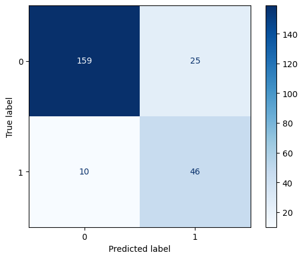
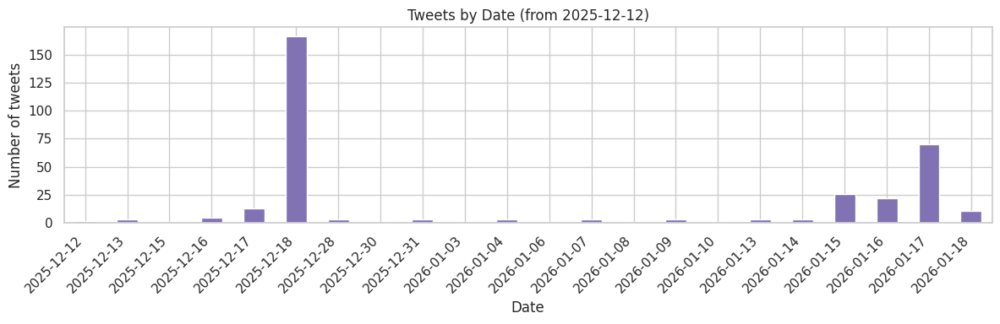
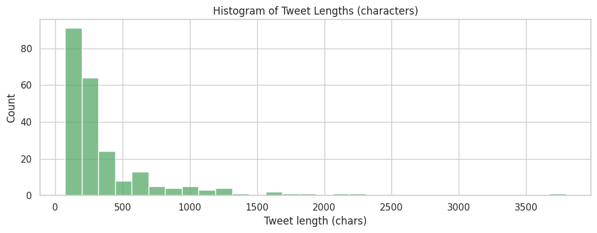
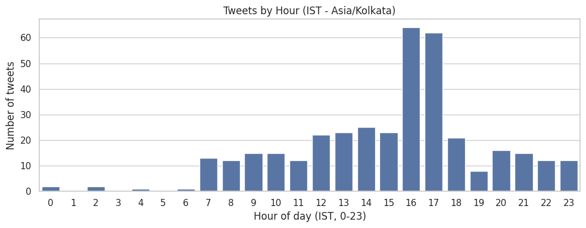
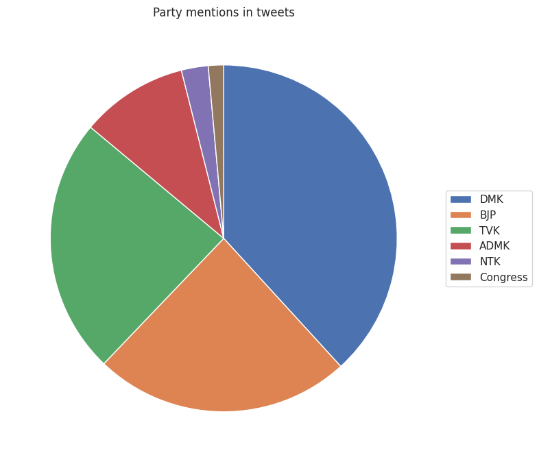
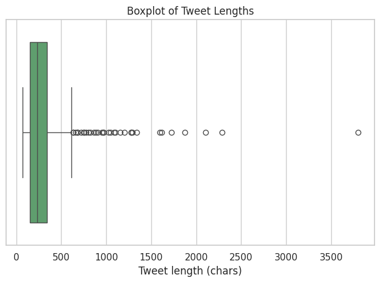
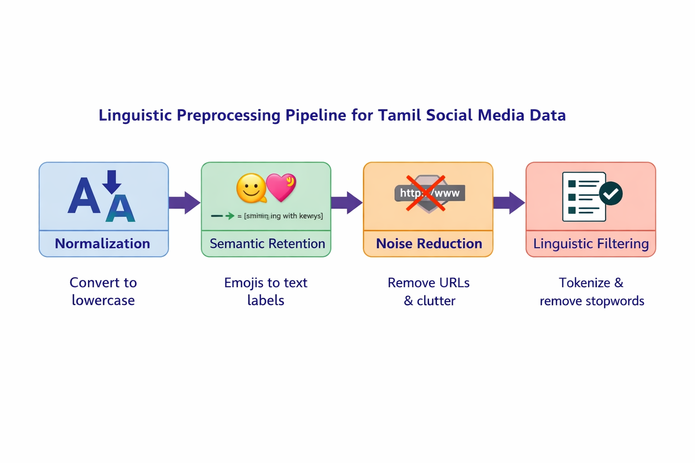
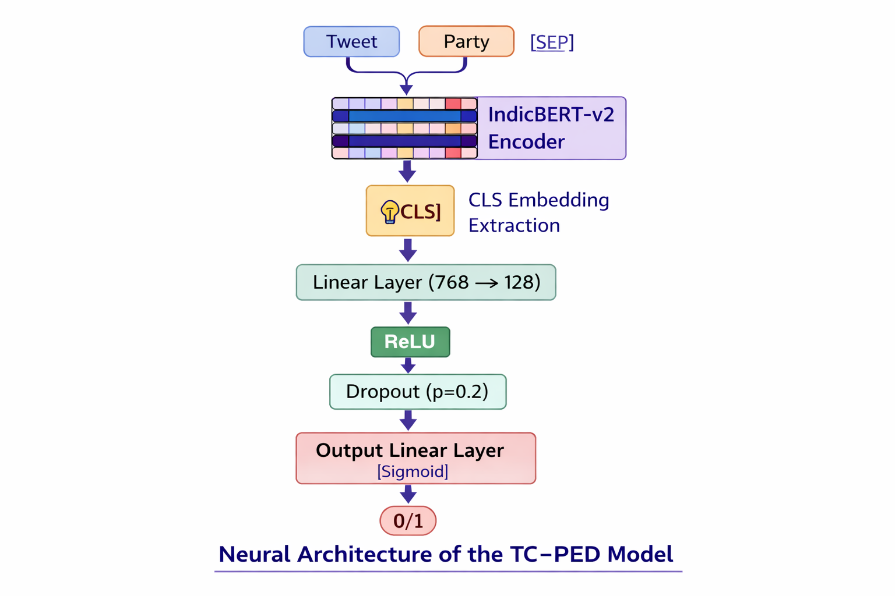

# 🎯 TC-PED: Target-Conditioned Party Entity Detection

**Intelligent political entity identification in Tamil social media using contextual embeddings and transformer models**


---

## 📋 Table of Contents
- [Quick Overview](#quick-overview)
- [The Problem](#the-problem)
- [Our Solution](#our-solution)
- [Key Results](#key-results)
- [Project Flow & Data](#project-flow--data)
- [Technical Architecture](#technical-architecture)
- [Quick Start](#quick-start)
- [Model Inference](#model-inference)
- [Repository Structure](#repository-structure)
- [Team & Credits](#team--credits)

---

## Quick Overview

**TC-PED** is a sophisticated machine learning framework for detecting mentions of political parties in Tamil Nadu political tweets with high precision. Unlike traditional Named Entity Recognition (NER), our approach uses **target-conditioned binary classification** to validate if a specific party is the actual subject of discussion, not just mentioned peripherally.

### 🎯 Key Capabilities
- ✅ Detects 6 major Tamil Nadu political parties (ADMK, BJP, Congress, DMK, NTK, TVK)
- ✅ Handles code-switching, informal language, and morphological complexity in Tamil
- ✅ Achieves **ROC-AUC of 0.878** with **MCC of 0.6353** on imbalanced data
- ✅ Processes 1,200 target-tweet pairs with scalable binary relevance approach
- ✅ Implements early stopping and weighted loss for optimal class balance

---

## The Problem

### Why This Matters

Tamil Nadu has exceptionally high digital political engagement, but analyzing this data is complex:

1. **Linguistic Complexity**: Tamil is agglutinative—a single root word takes hundreds of forms through suffixes
2. **Code-Switching**: Tweets mix Tamil and English (Tanglish), requiring specialized parsing
3. **Contextual Ambiguity**: A party might be mentioned but not be the subject of discussion
4. **Class Imbalance**: Most tweets don't mention a specific party, creating severe data imbalance

### The Gap

Existing approaches use **multiclass sentiment analysis** (Positive/Negative/Neutral) or generic **NER**, but these fail when:
- One tweet criticizes party A while praising party B
- Standard tokenizers miss morphological variations of party names
- Models can't distinguish between relevant mentions and peripheral references

---

## Our Solution

### 🔧 The TC-PED Framework

Instead of multiclass classification, we implemented **Target-Conditioned Party Entity Detection** using:

#### 1️⃣ **Binary Relevance Transformation**
Each tweet is paired with each party individually, creating 1,200 samples (200 tweets × 6 parties):
```
Input:  (Tweet Text, Candidate Party) → Binary Label (0/1)
Example: ("DMK வாழ்க", "DMK") → 1 (mentioned)
       ("தொழிலாளர்கள் உரிமை", "BJP") → 0 (not mentioned)
```

#### 2️⃣ **CLS-Token Relational Embedding**
```
Input Format: [CLS] Tweet Text [SEP] Candidate Party [SEP]
                ↓
        IndicBERT-v2 Encoder (768-dim)
                ↓
        Extract CLS Token Embedding
                ↓
        Linear Layer (768→128) + ReLU + Dropout
                ↓
        Output Layer (128→1) + Sigmoid
                ↓
        Binary Classification (Mentioned/Not Mentioned)
```

The **[CLS] token** acts as a "relational bridge" capturing semantic relationships between tweet and party, with self-attention mechanisms focusing on party-relevant words.

#### 3️⃣ **Why IndicBERT-v2?**
- Pre-trained on Indian scripts (Tamil included)
- Understands agglutinative morphology natively
- Doesn't tokenize party names incorrectly like general multilingual models

---

## Key Results

### 📊 Performance Metrics

| Metric | Score | Interpretation |
|--------|-------|-----------------|
| **Precision** | 0.6479 | 64.8% of predicted mentions are correct |
| **Recall** | 0.8214 | Captures 82.1% of actual mentions |
| **F1-Score** | 0.7244 | Balanced precision-recall harmony |
| **🏆 MCC** | **0.6353** | Strong correlation even with class imbalance |
| **🏆 ROC-AUC** | **0.8780** | Excellent discriminative ability |

### Confusion Matrix Results (240 test samples)


*Figure 3: Confusion Matrix for Political Party Mention Detection*

- ✅ **True Positives**: 46 (correctly identified mentions)
- ✅ **True Negatives**: 159 (correctly rejected non-mentions)
- ❌ **False Negatives**: 10 (missed mentions)
- ⚠️ **False Positives**: 25 (type I error trade-off)

**Why MCC matters**: Unlike accuracy, MCC accounts for all four confusion matrix quadrants, making it ideal for imbalanced datasets where simply predicting "not mentioned" would give 80%+ accuracy but miss all real positives.

---

## Project Flow & Data

### 📈 Data Exploration & Journey

<div align="center">


*Temporal distribution of collected Tamil political tweets*


*Tweet length distribution in dataset*


*Political engagement patterns across hours*

</div>

### 📊 Party Mention Patterns

<div align="center">


*Mentions across 6 major Tamil Nadu political parties*


*Length distribution of tweets*

</div>

### Dataset Composition
- **Raw Tweets**: 200 manually annotated Tamil political tweets
- **Expanded Dataset**: 1,200 target-tweet pairs (200 × 6 parties)
- **Train-Test Split**: 80-20 stratified (960 train, 240 test)
- **Annotation Tool**: Label Studio
- **Class Distribution**: ~32% positive mentions (minority class), ~68% non-mentions

### 🛠️ Data Pipeline


*Figure 1: Linguistic Preprocessing Pipeline for Tamil Social Media Data*

```
Raw Tweets (X/Twitter)
    ↓
Manual Annotation (Label Studio) → Multi-label format
    ↓
Binary Relevance Transformation → Target-Tweet Pairs
    ↓
Preprocessing Pipeline:
  • Lowercase normalization
  • Emoji demojization (semantic preservation)
  • URL removal via regex
  • Tokenization + stopword removal (NLTK)
    ↓
Ready for IndicBERT encoding
```

---

## Technical Architecture

### 🧠 Model Design


*Figure 2: Neural Architecture of the TC-PED Model*

```python
# Key Architecture Components
Model: IndicBERT-v2 (MLM) + Binary Classification Head

Input Shape:   (Batch, Max_Seq_Length=128)
Encoder Output: (Batch, 768)  # CLS token extraction
Hidden Layer:  (128, dropout=0.2, ReLU)
Output:        (1, sigmoid) → probability [0,1]
```

### ⚙️ Hyperparameters & Training

| Parameter | Value | Rationale |
|-----------|-------|-----------|
| Learning Rate | 2×10⁻⁵ | Small LR for fine-tuning pre-trained model |
| Batch Size | 4 | Memory efficiency for embeddings |
| Max Seq Length | 128 | Sufficient for typical tweets |
| Hidden Units | 128 | Balance between capacity & overfitting |
| Dropout | 0.2 | Regularization for robustness |
| Loss Function | BCEWithLogitsLoss | Combined Sigmoid + BCE for stability |
| Optimizer | AdamW | Decoupled weight decay |
| Early Stopping | Patience=3 | Stopped at epoch 5 (best validation) |
| Gradient Clip | 1.0 | Prevent exploding gradients |

### Training Convergence

```
Epoch 1:  Train Loss = 1.1078, Val Loss = 1.0651
Epoch 5:  Train Loss = 0.9419, Val Loss = 0.9613  ← Best Model
Epoch 10: Train Loss = 0.4708, Val Loss = 1.3432  ← Early Stop
```

**Key Insight**: Model achieved convergence by epoch 5; continuing to epoch 10 showed validation loss divergence (overfitting indicator).

### 🎯 Handling Class Imbalance

```python
# BCEWithLogitsLoss with pos_weight
pos_weight = (num_negative_samples / num_positive_samples)
# Upweights minority class during backprop
# Result: 82.1% recall vs. ~50% without weighting
```

---

## Quick Start

### Prerequisites
- Python 3.9+
- 8GB+ RAM (16GB recommended for model training)
- GPU optional but recommended (CUDA 11.8+)

### Installation

```bash
# Clone and setup environment
git clone https://github.com/yourusername/TC-PED.git
cd TC-PED

# Create virtual environment
python -m venv .venv
source .venv/bin/activate  # On Windows: .venv\Scripts\activate

# Install dependencies
pip install -r requirements.txt
```

### Model Inference

Download the trained model weights from Google Drive before running inference.

#### Download Model Weights

- Google Drive: https://drive.google.com/file/d/1l22-HEmH6tRWWl6REeIzgQ2NGtQ7CEjN/view?usp=drive_link

After downloading, place the file in the project root or provide its path when running the script.

#### Usage

```bash
# Run inference with the downloaded model file
python infer.py /path/to/best_model.pth
```

#### Interactive Mode

The script enters an interactive mode where you can:

1. **Enter tweet text**: Input any Tamil or English tweet
2. **Enter party name**: Specify one of the 6 supported parties (ADMK, BJP, Congress, DMK, NTK, TVK)
3. **Get prediction**: Receive binary classification result (MENTIONED/NOT MENTIONED) with confidence score


#### Supported Parties
- ADMK (All India Anna Dravida Munnetra Kazhagam)
- BJP (Bharatiya Janata Party)
- Congress (Indian National Congress)
- DMK (Dravida Munnetra Kazhagam)
- NTK (Naam Tamilar Katchi)
- TVK (Thamizhaga Vetri Kazhagam)

#### Exit Commands
- Type `quit` for either tweet or party input
- Press `Ctrl+C` to interrupt

---

## Repository Structure

```
TC-PED/
├── 📄 README.md (this file)
├── 📄 Project_submitted_to_Instituition.pdf    # Project submission document
├── 📄 Technical_Report.pdf                    # Technical report
│
├── 📁 data/
│   ├── tweet_is_political_2026-02-15.csv          # Political vs non-political labels
│   ├── tweet_party_mention_2026-02-15.csv         # Party mention annotations
│   └── tweet_party_stance_onehot_2026-02-15.csv   # Stance labels (one-hot)
│
├── 📁 Preprocessing/
│   ├── preprocess_for_labelling.ipynb            # Data cleaning for annotation
│   ├── preprocess_for_model.ipynb                # Binary relevance transformation
│   ├── project-1-at-2026-01-27-05-06-e12e4e5a.csv # Label Studio project export
│   └── tweet_for labelling.csv                   # Tweets prepared for labeling
│
├── 📁 EDA/
│   ├── Diagrams.ipynb                            # Exploratory visualizations
│   ├── tweet_by_date.png                         # Temporal patterns
│   ├── tweet_by_hour.png                         # Hourly engagement
│   ├── tweet_by_length.png                       # Tweet length distribution
│   ├── party_tweet.png                           # Party distribution
│   ├── political_tweet.png                       # Political tweet analysis
│   └── box_plot_tweet_length.png                 # Length analysis box plot
│
├── 📁 diagrams/
│   ├── Figure1.png                               # Preprocessing Pipeline
│   ├── Figure2.png                               # Model Architecture
│   └── Figure3.png                               # Confusion Matrix (Results)
│
├── 🎓 TC_PED__Target_Conditioned_Party_Entity_Detection.ipynb
│   └── Main project notebook (EDA + Model training)
│
├── 🤖 infer.py                                   # CLI inference script for party mention detection
│
├── 📋 labelling.xml                              # Label Studio export
│
└── 📋 requirements.txt                           # Python dependencies
```

---

## Skills Demonstrated

### 🤖 **AI & Machine Learning**
- Transformer architecture fine-tuning (IndicBERT-v2)
- NLP for morphologically-rich, low-resource languages
- Binary relevance approach to multi-label problems
- Class imbalance handling (weighted loss, evaluation metrics)
- Early stopping & regularization techniques

### 📊 **Data Science**
- Exploratory Data Analysis (EDA) with visualization
- Statistical evaluation (MCC, ROC-AUC, confusion matrices)
- Data annotation workflow (Label Studio)
- Train-test stratification for imbalanced data
- Preprocessing pipeline design

### 💻 **Engineering**
- Python (PyTorch, Transformers, scikit-learn, pandas)
- Jupyter notebooks for reproducible research
- Git version control
- Hyperparameter tuning & model evaluation

### 🌐 **Domain Expertise**
- Natural Language Processing (NLP)
- Political data science
- Regional language computing (Indian languages)
- Social media text analysis

---

## Future Enhancements

- [ ] Cross-lingual transfer to other South Indian languages (Telugu, Kannada)
- [ ] Real-time streaming inference pipeline
- [ ] Ensemble methods with other Indian language models
- [ ] Explainability analysis (attention visualizations)
- [ ] Deployment as REST API with containerization (Docker)
- [ ] Multilingual stance detection (pro/against/neutral per party)

---

## References & Citations

Key works that inspired this project:

- Derczynski, L., Nichols, E., Erp, M. V., & Limsopatham, N. (2017). Results of the WNUT2017 Shared Task on Novel and Emerging Entity Recognition. *NUT@EMNLP*. https://doi.org/10.18653/V1/W17-4418
- Devlin, J., Chang, M. W., Lee, K., & Toutanova, K. (2019). BERT: Pretraining of Deep Bidirectional Transformers for Language Understanding. *North American Chapter of the Association for Computational Linguistics*. https://doi.org/10.18653/V1/N19-1423
- Khatavkar, V., Petkar, S., & Vaidya, A. S. (2025). Multilingual Transformer Contextual Embedding Model for Political Tweets Analysis. *Cureus Journal of Computer Science*. https://doi.org/10.7759/s44389-025-03177-4
- Kumanan, S. P., et al. [AI4Bharat] (2020). IndicNLPSuite: Monolingual Corpora, Evaluation Benchmarks and Pre-trained Multilingual Language Models for Indian Languages. *Findings of the Association for Computational Linguistics: EMNLP 2020*. https://doi.org/10.18653/v1/2020.findings-emnlp.445
- Lample, G., Ballesteros, M., Subramanian, S., Kawakami, K., & Dyer, C. (2016). Neural Architectures for Named Entity Recognition. *North American Chapter of the Association for Computational Linguistics*. https://doi.org/10.18653/V1/N16-1030
- Li, J., Sun, A., Han, J., & Li, C. (2020). A Survey on Deep Learning for Named Entity Recognition. *IEEE Transactions on Knowledge and Data Engineering*. https://doi.org/10.1109/TKDE.2020.2981314
- Liu, W., & Cui, X. (2023). Improving Named Entity Recognition for Social Media with Data Augmentation. *Applied Sciences*. https://doi.org/10.3390/APP13095360
- Moon, S., Neves, L., & Carvalho, V. (2018). Multimodal Named Entity Recognition for Short Social Media Posts. *North American Chapter of the Association for Computational Linguistics*. https://doi.org/10.18653/V1/N18-1078
- Nie, Y., Tian, Y., Wan, X., Song, Y., & Dai, B. (2020). Named Entity Recognition for Social Media Texts with Semantic Augmentation. *Conference on Empirical Methods in Natural Language Processing*. https://doi.org/10.18653/V1/2020.EMNLP-MAIN.107
- Suriya, K. P., et al. [Synapse] (2025). Synapse@DravidianLangTech 2025: Multiclass Political Sentiment Analysis in Tamil X (Twitter) Comments: Leveraging Feature Fusion of IndicBERTv2 and Lexical Representations. *Proceedings of the Fifth Workshop on Speech, Vision, and Language Technologies for Dravidian Languages (NAACL 2025)*. https://doi.org/10.18653/v1/2025.dravidianlangtech-1.122

---

## Team & Credits

**Project Team:**
- Braxton Geno Anand B (23UST105)
- Tharunkumar M (23UST108)
- Mohamed Yasar Arafadh A (23UST135)
- Mystica Rose D (23UST156)
- Aarthi S (23UST157)

**Guidance:** Dr. Lilly George, Assistant Professor, Department of Statistics  
**Institution:** St. Joseph's College (Autonomous), Tiruchirappalli

**SDG Alignment:** UN Sustainable Development Goal 16 - Peace, Justice and Strong Institutions

---

## 📝 License

This project is submitted as partial fulfillment for the degree of Bachelor of Science in Statistics at St. Joseph's College (Autonomous), 2026.

---

**Questions?** Feel free to open an issue or reach out through the contact info in the professional profile.

*Last Updated: April 2026*
